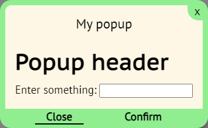
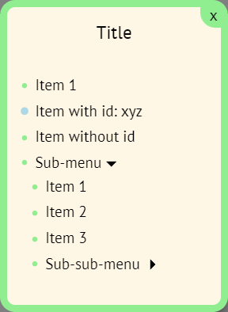

# littleLib
Libs with useful functions
### [Examples](https://mixelte.github.io/littleLib/docs/)

## Lib files
typescript:
- littleLib: ts/littleLib.ts
- popupLib: ts/popup.ts + wwwroot/popup.css
- figuresLib: ts/figuresLib.ts + ts/littleLib.ts


javascript:
- littleLib: docs/js/littleLib.js
- popupLib: docs/js/popup.ts + docs/popup.css
- figuresLib: docs/js/figuresLib.ts + docs/js/littleLib.js

# Usage
* [littleLib](#littleLib)
* [popup](#popup)
* [Context menu](#context-menu)
* [figuresLib](#figuresLib)

## littleLib
``` js
import * as Lib from "./littleLib.js"
```
### Get Html element
function                  | arguments  | return
--------------------------|------------|---------------
Lib.get.div               | id: string | HTMLDivElement
Lib.get.button            | id: string | HTMLButtonElement
Lib.get.canvas            | id: string | HTMLCanvasElement
Lib.get.input             | id: string | HTMLInputElement


### Canvas functions
function                          | arguments                                                       | return
----------------------------------|-----------------------------------------------------------------|-----------------
Lib.canvas.getContext2d           | canvas: HTMLCanvasElement                                       | CanvasRenderingContext2D
Lib.canvas.fitToParent.BCR        | canvas: HTMLCanvasElement                                       |
Lib.canvas.fitToParent.ClientWH   | canvas: HTMLCanvasElement                                       |
Lib.canvas.drawGrid               | ctx: CanvasRenderingContext2D, cellSize: number, color?: string |
Lib.canvas.drawCoords             | ctx: CanvasRenderingContext2D, x: number, y: number             |


### Intersection test functions
function                        | arguments                          | return
--------------------------------|------------------------------------|---------------
Lib.intersection.rectPoint      | rect: IRect, point: IPoint         | boolean
Lib.intersection.rects          | rect1: IRect, rect2: IRect         | boolean
Lib.intersection.circlePoint    | circle: ICircle, point: IPoint     | boolean
Lib.intersection.circles        | circle1: ICircle, circle2: ICircle | boolean

#### IPoint:
parameter | type
----------|--------
x	        | number
y	        | number

#### IRect:
parameter | type
----------|--------
x	        | number
y	        | number
width     | number
height    | number

#### ICircle:
parameter | type
----------|--------
x	        | number
y	        | number
r	        | number

### Get random values
function                  | arguments                    | return
--------------------------|------------------------------|---------------
Lib.random.int            | max: number                  | 0 >= number < max
Lib.random.int            | min: number, max: number     | min >= number < max
Lib.random.boolean        |                              | boolean
Lib.random.asbOrNot       | num: number                  | num or -num


### Other functions
function                    | arguments                              | return
----------------------------|----------------------------------------|---------------
Lib.square                  | num: number                            | num * num
Lib.loadScript              | scriptPath: string                     |
Lib.addButtonListener       | id: string, f: (e: MouseEvent) => void |
Lib.capitalize              | text: string                           | Text
Lib.copyText (to clipboard) | text: string                           |
Lib.downloadFile            | filename: string, text: string         |

### HTML build
function                  | return
--------------------------|---------------
Lib.Div                   | HTMLDivElement
Lib.Span                  | HTMLSpanElement
Lib.H1                    | HTMLHeadingElement

#### Arguments
argument                  | type
--------------------------|--------------------
classes                   | string[] \| string
children                  | HTMLElement[]
innerText                 | string

function                  | arguments | return
--------------------------|-----------|---------------
Lib.Input                 | classes?: string[] \| string, type?: string, placeholder?: string      | HTMLInputElement
Lib.Button                | classes?: string[] \| string, innerText?: string, clickListener?: (btn: HTMLButtonElement) => void     | HTMLButtonElement

#### Example
``` js
import { Div, H1, Span, Input } from "../littleLib.js";

document.body = Div("main", [
	H1("header", [], "Page header"),
	Div("content", [
		Div("text", [], "Some text"),
		Div([], [
			Span([], [], "Enter something: "),
			Input("input", "text"),
		]),
		Div(["text", "text-bold"], [], "Bold text"),
	]),
])
```

#### initEl
Arguments:
argument                  | type
--------------------------|--------------------
tagName                   | string (keyof HTMLElementTagNameMap)
classes                   | string[] \| string \| undefined
children                  | HTMLElement[] \| undefined
innerText                 | string \| undefined

#### Example
``` ts
import { initEl } from "../littleLib.js";

export function H2(classes?: string[] | string, children?: HTMLElement[], innerText?: string)
{
	return initEl("h2", classes, children, innerText);
}
```
``` ts
import { initEl, Button, Div } from "../littleLib.js";

export function FoldSection(classes?: string[] | string, buttonText?: string, children?: HTMLElement[], folded = true)
{
	const btn = Button([], buttonText);
	const container = Div([], children);
	if (folded) container.style.display = "none";
	btn.addEventListener("click",
		() => container.style.display == "none" ? container.style.display = "block" : container.style.display = "none");
	return initEl("section", classes, [btn, container], undefined);
}
```

## popup
``` html
<!-- Popup styles -->
<link rel="stylesheet" type="text/css" href="popup.css">
```
``` js
import Popup from "./popup.js"

const popup = new Popup();
```
### Set content of the popup
Assign any html element to popup.content

``` js
// Example
popup.content = Div("content", [
	H1([], [], "Popup header"),
	Div([], [
		Span([], [], "Enter something: "),
		Input("some-input", "text"),
	]),
])
```
### Сonfigure popup
All properties works before popup opening and while it`s open too
Property         | Description                                            | Value                                 | Default
-----------------|--------------------------------------------------------|---------------------------------------|---------
title            | Title of popup                                         | string                                | ""
okText           | Text on Confirm button                                 | string                                | "OK"
cancelText       | Text on Cancel button                                  | string                                | "Cancel"
okBtn            | Dislay Confirm button                                  | boolean                               | true
cancelBtn        | Dislay Cancel button                                   | boolean                               | true
focusOn          | Set focus on popup element                             | "ok" \| "cancel" \| "close" \| "none" | "ok"
reverse          | Swap Confirm and Cancel buttons                        | boolean                               | false
closeOnBackClick | whether the popup closes on a click outside of it      | boolean                               | true
closeEscape      | whether the popup closes on pressing the Escape button | boolean                               | true

``` js
// Example
popup.title = "My popup";
popup.okText = "Confirm";
popup.cancelText = "Close";
popup.focusOn = "cancel";
```

### Open popup
Method      | Returns
------------|---------
open()      | void
openAsync() | Promise\<boolean\> - is Confirm button pressed

### Listen for popup events
Methods addListener and removeListener.

Param    | Type                   | Type
---------|------------------------|--------
type     | "ok" \| "cancel"       | "close"
function | (popup: Popup) => void | (popup: Popup, confirmed: boolean) => void

All events fire on popup close. Event "close" fires after "ok" or "cancel" event.

``` js
// Example
popup.addListener("ok", () => console.log("Popup confirmed"))
popup.addListener("cancel", () => console.log("Popup canceled"))
popup.addListener("close", (_, c) =>
	console.log(`Popup closed with status ${c ? "confirmed" : "canceled"}`)
);
```

### Close popup manualy
Works with openAsync too.
``` ts
popup.close(confirmed: boolean)
```
The result of the examples above:




## Context menu
``` js
import contextMenu from "./popup.js"
```

Param | Type
------|------------------
title | string
items | contextMenuItem[]

Returns: Promise\<string \| null\> - id of selected item

#### contextMenuItem:
Param    | Type                           | Description
---------|--------------------------------|-------------
text     | string                         | Text on item
id       | string \| undefined            | Id of item (if undefined, the item cannot be selected)
subItems | contextMenuItem[] \| undefined | If defined, the item is used as the title for the collapsible submenu.

``` js
// Example
const r = await contextMenu("Title", [
	{ text: "Item 1", id: "item1"},
	{ text: "Item with id: xyz", id: "xyz"},
	{ text: "Item without id" },
	{ text: "Sub-menu", subItems: [
		{ text: "Item 1", id: "item2"},
		{ text: "Item 2", id: "item3"},
		{ text: "Item 3", id: "item4" },
		{ text: "Sub-sub-menu", subItems: [
			{ text: "Item 1", id: "item5"},
			{ text: "Item 2", id: "item6"},
			{ text: "Item 3", id: "item7"},
		]},
	]},
]);
```


## figuresLib
!Depends on littleLib
``` js
import * as FLib from "./figuresLib.js"
```
### Move animator
``` js
const moveAnimator =  new FLib.MoveAnimator(x, y, shiftX, shiftY, maxX, maxY, stepX, stepY);
```
#### Constructor:
argument    | type
------------|-------
x           | number
y           | number
shiftX      | number
shiftY      | number
maxX        | number
maxY        | number
stepX       | number \| (() => number)
stepY       | number \| (() => number)

#### Methods:
method          | arguments      | return
----------------|----------------|-----------
X               |                | x + shiftX
Y               |                | y + shiftY
nextX           | step?: number  | x + shiftX
nextY           | step?: number  | y + shiftY
nextBounceX     | step?: number  | x + shiftX
nextBounceY     | step?: number  | y + shiftY


### Point
``` ts
const point = new FLib.Point(x: number, y: number);
```

#### Methods:
method          | arguments                     | return
----------------|-------------------------------|-----------
intersectRect   | rect: IRect                   | boolean
intersectCircle | circte: ICircle               | boolean
fill          	| ctx: CanvasRenderingContext2D |
stroke          | ctx: CanvasRenderingContext2D |
copy          	|                               | Point
getPoint        |                               | Point


### Rect
``` ts
const rect = new FLib.Rect(x: number, y: number, width: number, height: number);
const rect = new FLib.Rect.Create(point: IPoint, width: number, height: number);
const rect = new FLib.Rect.Create2(point: IPoint, point2: IPoint);
```

#### Methods:
method          | arguments                     | return
----------------|-------------------------------|-----------
intersectRect   | rect: IRect                   | boolean
intersectPoint  | point: IPoint                 | boolean
fill          	| ctx: CanvasRenderingContext2D |
stroke          | ctx: CanvasRenderingContext2D |
copy          	|                               | Rect
getPoint        |                               | Point


### Circle
``` ts
const circle = new FLib.Circle(x: number, y: number, r: number);
const circle = new FLib.Circle.Create(point: IPoint, r: number);
```

#### Methods:
method          | arguments                     | return
----------------|-------------------------------|-----------
intersectCircle | circte: ICircle               | boolean
intersectPoint  | point: IPoint                 | boolean
fill          	| ctx: CanvasRenderingContext2D |
stroke          | ctx: CanvasRenderingContext2D |
copy          	|                               | Circle
getPoint        |                               | Point

### IFigure
parameter | type
----------|------
fill      |(ctx: CanvasRenderingContext2D) => void,
stroke    |(ctx: CanvasRenderingContext2D) => void,
copy      |() => IFigure,
getPoint  |() => Point,